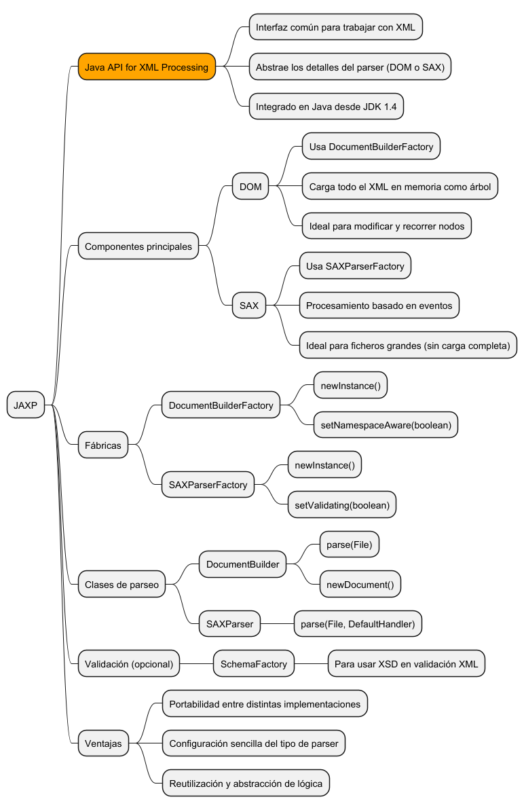
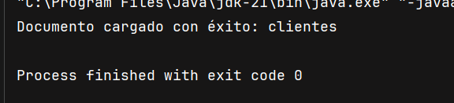
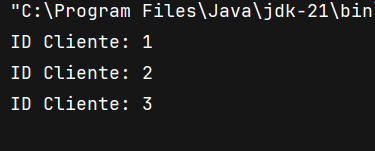
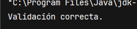

**Descripción**  
En esta unidad se amplía el conocimiento sobre la API estándar JAXP, usada para procesar XML en Java de forma unificada. Se estudian sus componentes, clases clave, modos de funcionamiento (DOM y SAX), validación XML con XSD y ventajas para el desarrollo modular y portable.



## ¿Qué es JAXP?

JAXP (Java API for XML Processing) es una interfaz estándar que proporciona mecanismos para trabajar con XML en Java sin depender de una implementación concreta. Su objetivo es abstraer el uso de parsers (DOM, SAX, StAX) y facilitar la portabilidad.

Desde Java 1.4 está integrado de forma nativa.

- Permite usar diferentes estrategias de análisis (DOM, SAX) mediante factorías.
    
- Admite validación contra esquemas XSD.
    
- Se puede combinar con otras APIs como XPath y XSLT.
    

## Componentes principales de JAXP

|Componente|Función principal|
|---|---|
|`DocumentBuilderFactory`|Fábrica para crear parsers DOM|
|`DocumentBuilder`|Construye objetos `Document` desde XML|
|`SAXParserFactory`|Fábrica para crear parsers SAX|
|`SAXParser`|Parser SAX basado en eventos|
|`TransformerFactory`|Fábrica de transformadores para generar salida XML|
|`SchemaFactory`|Permite activar validación con XSD|

## Uso de JAXP con DOM
```java
import javax.xml.parsers.*;
import org.w3c.dom.*;
import java.io.File;

public class JAXP_DOM {
    public static void main(String[] args) {
        try {
            DocumentBuilderFactory dbf = DocumentBuilderFactory.newInstance();
            dbf.setNamespaceAware(true); // opcional
            DocumentBuilder builder = dbf.newDocumentBuilder();
            Document doc = builder.parse(new File("datos/clientes.xml"));

            System.out.println("Documento cargado con éxito: " + doc.getDocumentElement().getNodeName());
        } catch (Exception e) {
            System.out.println("Error JAXP DOM: " + e.getMessage());
        }
    }
}
```


## Uso de JAXP con SAX
```java
import javax.xml.parsers.*;
import org.xml.sax.*;
import org.xml.sax.helpers.DefaultHandler;
import java.io.File;

public class JAXP_SAX {
    public static void main(String[] args) {
        try {
            SAXParserFactory spf = SAXParserFactory.newInstance();
            spf.setValidating(false);
            SAXParser parser = spf.newSAXParser();

            parser.parse(new File("datos/clientes.xml"), new DefaultHandler() {
                public void startElement(String uri, String localName, String qName, Attributes attributes) {
                    if (qName.equals("cliente")) {
                        System.out.println("ID Cliente: " + attributes.getValue("id"));
                    }
                }
            });

        } catch (Exception e) {
            System.out.println("Error JAXP SAX: " + e.getMessage());
        }
    }
}

```


## Validación de XML con XSD usando JAXP
```java
import javax.xml.parsers.*;
import javax.xml.validation.*;
import org.xml.sax.SAXException;
import org.w3c.dom.Document;
import java.io.File;

public class JAXP_Validacion {
    public static void main(String[] args) {
        try {
            SchemaFactory schemaFactory = SchemaFactory.newInstance("http://www.w3.org/2001/XMLSchema");
            Schema schema = schemaFactory.newSchema(new File("datos/clientes.xsd"));

            DocumentBuilderFactory factory = DocumentBuilderFactory.newInstance();
            factory.setSchema(schema);

            DocumentBuilder builder = factory.newDocumentBuilder();
            Document doc = builder.parse(new File("datos/clientes.xml"));

            System.out.println("Validación correcta.");

        } catch (SAXException e) {
            System.out.println("Error de validación: " + e.getMessage());
        } catch (Exception e) {
            System.out.println("Error general: " + e.getMessage());
        }
    }
}
```


## Ventajas de usar JAXP

- Portabilidad entre distintos parsers (internos o externos).
    
- Separación de lógica de análisis y lógica de negocio.
    
- Compatible con herramientas modernas como XPath, XSLT, JAXB.
    
- Estándar aceptado por la mayoría de frameworks Java.
    
- Soporte para validación con esquemas (XSD).
    

JAXP es la base sobre la que se construyen muchas soluciones de interoperabilidad en Java.